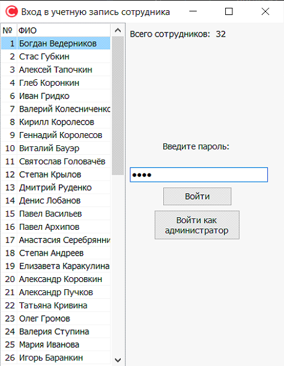
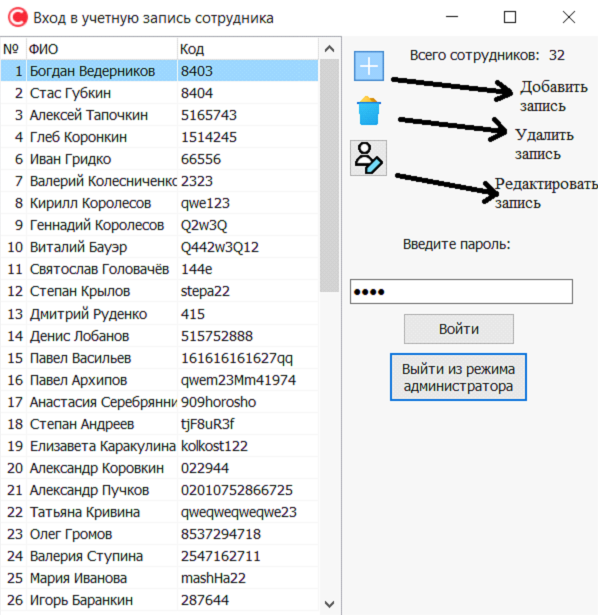
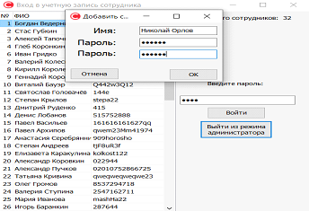
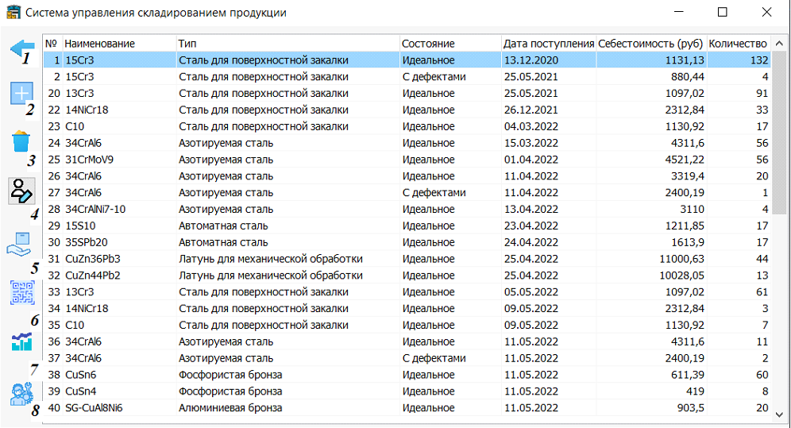
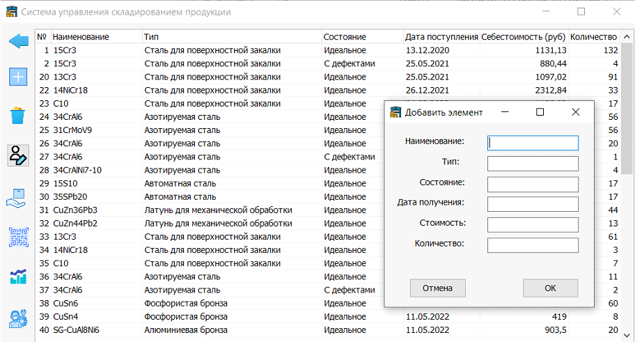
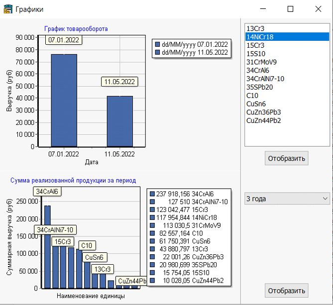
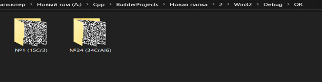
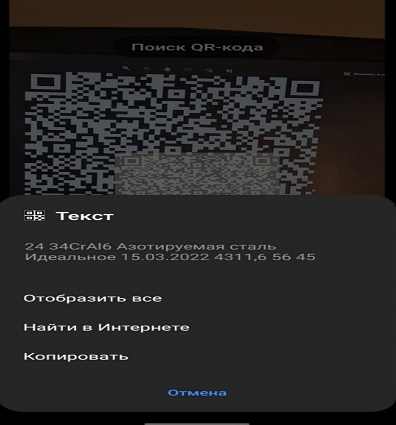

# Warehouse Management System (Система управления складированием продукции)
Система управления складированием продукции (СУСП) - это программа для управления складскими операциями, которая поможет автоматизировать и оптимизировать процессы управления продукцией на складе. Она предоставляет удобный интерфейс для работы с продукцией и сотрудниками, а также позволяет генерировать QR-коды, отслеживать поступление и отбытие продукции, анализировать данные и строить графики для принятия управленческих решений.

# Основные функции
## Управление продукцией на складе
Программа позволяет добавлять, редактировать и удалять продукцию на складе, а также просматривать информацию о каждом товаре в базе данных. Для каждого товара генерируется уникальный QR-код, который можно распечатать и прикрепить к товару для удобства идентификации.

## Управление сотрудниками
WMS имеет базу данных сотрудников, в которой можно добавлять, редактировать и удалять информацию о каждом сотруднике. Это позволяет контролировать доступ к базе данных и обеспечить безопасность хранения данных.

## Отслеживание поступления и отбытия продукции
Программа позволяет отслеживать поступление и отбытие продукции на складе с помощью системы сканирования QR-кодов. Каждый раз при перемещении продукции на складе, сотрудник должен отсканировать соответствующий QR-код, чтобы программа могла автоматически обновить информацию о местонахождении продукции в базе данных.

## Анализ данных и построение графиков
WMS позволяет анализировать данные о продукции на складе и строить графики для принятия управленческих решений. Например, можно построить график товарооборота за определенный период времени для каждого вида товара на складе, чтобы определить, какой товар является наиболее востребованным. Это позволяет эффективно управлять пространством склада и повысить прибыль.

# Примечания
- В папке Warehouse Management System находится скомплированная версия программы.
- В папке DiplomaFiles находятся файл отчета и презентации выпускной квалификационной работы. В них очень-очень много воды, однако можно узнать некоторые подробности о программе.
- Программа встречает пользователя окном входа в учетную запись рабочего (можно увидеть ниже на скриншотах), и для входа в соответствующую учетную запись требуется ввести пароль, лежающий в файле Workers папки DataBase. Например, для учетной записи "Богдан Ведерников" можно ввести пароль "8403". Пароль для входа в режим администратора - "useR".
- Эта программа была написана 2 года назад в качестве дипломной работы в университете, на языке C++ в среде Embarcadero C++ Builder, который был преподаван в университете. Прекрасно понимаю, что программа написана неоптимально и некрасиво мягко говоря. Помимо моих кривых на тот момент рук, благодаря среде разработки в программе могут быть некоторые архаичные решения. Однако, это был первый относительно крупный проект, за который я взялся, и он был создан с максимальным усердием, энтузиазмом и удовольствием при написании.

# Скриншоты

 

